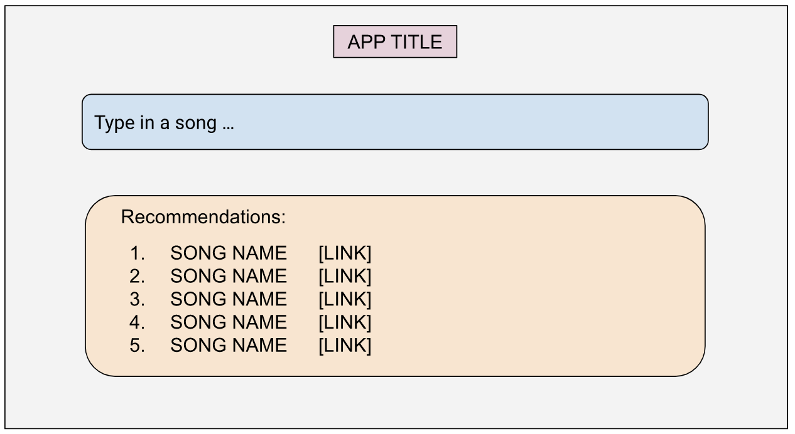
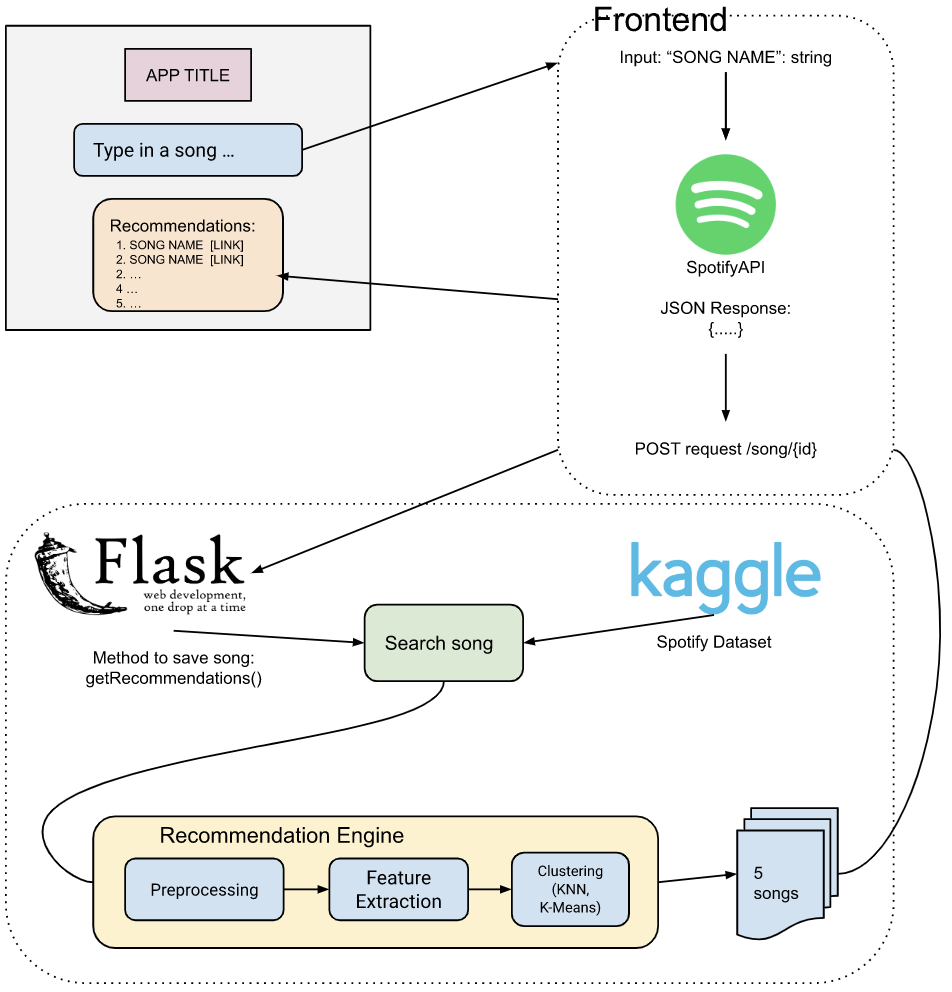

<h1 align="center"> Music Recommendation </h1>
<h5 align="center"> View the app in production <a href="https://test-3k13.onrender.com/">here</a>. </h5>

Music recommendation web application allows users to connect with Spotify and
find top-hit songs using our custom-built AI recommendation engine. The two
main aspects of the app include the Recommendation engine (backend) and the
User Interface/Experience (frontend). The recommendation system will predict
songs based on the users recently watched or by a given song using a
supervised machine learning algorithm. The frontend consists of a web
application which will include UI components to allow for a seamless user
experience. API requests connect and transfer data from frontend to backend.

## Tech Stack

- ReactJS (frontend)
- Python (backend)
- Flask (API to connect frontend/backend)
- Render (web app deployment)

## MVP

**Website UI Interface/Experience**

**MVP Product Flowchart**

## User Roles

- This app has one kind of user: user interested in getting song
  recommendations
- This can have 2 user modes: user linked and not linked with their Spotify
  account

## Roles and Permission

- For initial launch, only allow users with `@ucsb.edu` login credentials
- A user linked with Spotify can access their Spotify playlists and recently
  played songs and select the songs they want to get recommendations on.
- A user not linked with Spotify can still get recommendations for songs if
  they type songs individually in search bar.

## Installation for MVP (02.09.23)

### Prerequisite

- Git
- Node
- Python 3.8
- Optional: serverless framework (for deploying flask app to a server)

### Dependencies

- Npm (Needed for running frontend and installing libraries for react)
- Flask (Used to connect to react frontend through api calls)
- Flask Cores (Needed for server side calling fetch)
- React Bootstrap (Used to create the navigation bar)
- React-Router-Dom (Used to route pages)
- React Native (Used for linking texts)
- Spotipy (Spotify API for python)
- Pytest (Testing framework for python)
- Jest (Testing framework for JavaScript)

### Installation Steps

1. Clone the GitHub Repo `git clone [REPO_URL]`
2. Ensure git, node, python packages and libraries have been installed
3. Go to appropriate folder to run the frontend app
   a. `cd frontend`
   b. `npm install`
   c. `npm start` to start the react app locally (ensure the backend is running first before if running locally)
4. Go to the appropriate folder to run the backend app
   a. In root directory run `python3 -m venv .venv` to create python testing environment
   b. `source .venv/bin/activate` to activate the virtual environment and `deactivate` to exit the virtual environment
   c. `cd backend/flask-api-serverless`
   d. `pip install requirements.txt`
   e. `python3 app.py` to start the backend server locally
5. For testing using localhost ensure `”proxy”: “http://localhost:5000”` is in the `package.json` file in the `frontend` directory. In `SearchBar.js` in `./frontend/components` make sure to change the fetch call to just be `/result`
6. If you wish to deploy the flask server checkout https://serverless.com for more information.

### Functionality

To test out the application visit the deployment URL: https://test-3k13.onrender.com/

Search your favorite song name to get recommendations. Type your song into the search bar and you will get 5 song recommendations (both artist and song title). With each song we have a link redirecting the user to the Spotify Link.

### Known Problems

If you find any problems, feel free to upload an issue in the GitHub repository or feature request.

:construction: Currently under development :construction: :

- Songs which are not valid may not be processed
- Songs must be typed in correctly as typos won’t be accepted
- Songs which may not exist might get processed and return recommendations
- NavBar buttons might be fixed for larger display sizes (Responsive App)

Most of these features under development were not planned to be finished before the MVP.

### Contributing

1. Fork it!
2. Create your feature branch: git checkout -b my-new-feature
3. Commit your changes: git commit -am 'Add some feature'
4. Push to the branch: git push origin my-new-feature
5. Submit a pull request :D

We encourage contributing to our repo, feel free to drop in your ideas or suggestions by writing an issue or feature request.