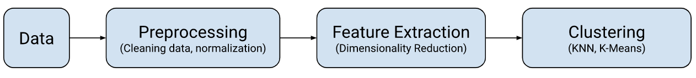

# Recommendation Engine

## :book: Introduction

(Figure 1. Recommendation Engine Data Flowchart)

To train a music recommendation system, we need access a large corpus of songs data. To do so there are multiple avenues to explore: (1) Find an existing dataset on Kaggle for Spotify songs and (2) Create a dataset from scratch by querying Spotify's API. After gathering data, we must preprocess the data through cleaning unnecessary rows and columns. Next, we must select features which are most important when it comes to recommending a song. With these features we can put the songs into a high-dimensional space. In this high-dimensional space, we hope that these songs form natural clusters. Finally, we can perform a clustering algorithm to find the closest-match songs.

## :clipboard: Data
**Kaggle**
Kaggle is an online platform for data scientists and engineers to compete for building accurate ML algorithms on datasets. I found the following [Spotify Dataset](https://www.kaggle.com/datasets/vatsalmavani/spotify-dataset).

Kaggle Spotify Dataset
| Dataset        | Size    | Features | Years     |
| -------------- | ------- | -------- | --------- |
| Kaggle Spotify | 170,654 | 19       | 1921-2020 |

This Kaggle Spotify dataset has 170K songs spanning from 1921-2020. It doesn't have the most recent songs from 2020-2022. The dataset consists of 19 features (e.g. year, acousticness, artists, danceability, duration_ms, energy, explicit, id, instrumentalness, key, liveness, loudness, mode, name, popularity, release_date, speechiness, temp).

**Spotify Web API**
[Spotipy](https://spotipy.readthedocs.io/en/2.16.1/) is a Python library for the Spotify Web App. We could experiment to determine if the Spotify API is the best fit for us. If this is easy to use, can give us more recent songs 
| Dataset        | Size | Features | Years     |
| -------------- | ---- | -------- | --------- |
| Custom Spotify | TBD  | TBD      | all years |

## :broom: Preprocessing
Preprocessing is an important step in a dataset. This can be reformatting the entires which have `null` values or removing rows and columns which are not necessary features. Furthermore, we can normalize the values (scale them so its easier and faster to process).

## :jigsaw: Feature Extraction
Feature extraction is a special form of dimensionality reduction. Having a group of 170K songs, we need to hand-pick features which contribute heavily to selecting a song such as (genre, year, and popularity) and not picking features such as (key, duration_ms, release_date, energy).

For the MVP, we decided that we would only consider the `genre`, therefore we could select any song which matches that genre. Later we can determine the concrete features which would be needed.

In the final project having genre, year and popularity would be useful and more (to be discussed later).

* Goal: Transform input data into a reduced representation of features (feature vector)
* Input Data: Large, notoriously redundant information in columns

If the extracted features are carefully selected, then they will allow us to perform the desired task using this reduced representation instead of the full-size input.

We hope that songs plotted closer together are in fact similar and can be the closest match to the user selected song. To find points which are closest together, we can find the minimum distance between points in $n$-dimensional space by using the distance formula.

$nD: \sqrt{(x_1-x_0)^2+(y_1-y_0)^2+(z_1-z_0)^2+ \ldots+(n_1-n_0)^2}$

## :o: Clustering
After selecting $k$ features, we can have a $k$-dimensional space with $n$ songs. Plotting the songs onto a $k$-dimensional space, the data may naturally form clusters and group songs which are more similar together.

We can then apply the $k$-Nearest Neighbors Algorithm and $k$-Means clustering algorithm.

TODO: add details about how kNN and kMeans work

## :books: References
* https://www.kaggle.com/datasets/vatsalmavani/spotify-dataset
* https://spotipy.readthedocs.io/en/2.16.1/